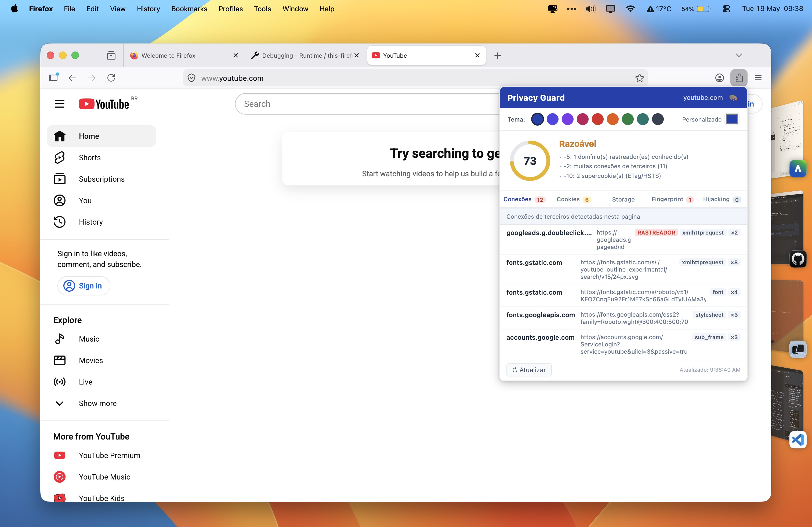
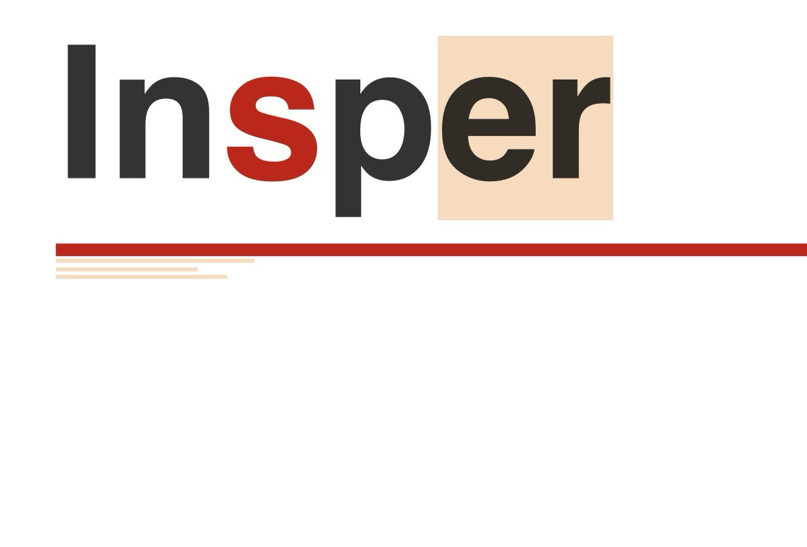

# Privacy Guard — Extensão Firefox

Extensão WebExtension para Firefox que detecta e apresenta as principais ameaças à privacidade e vetores de rastreamento presentes na navegação web moderna.

---

## Demonstração

A captura abaixo mostra a extensão em ação no **YouTube**, um dos sites com mais rastreamento na web:



**Resultado: Score 73 / 100 — "Razoável"**

Deduções detectadas pelo Privacy Guard no YouTube:
- **−5**: 1 domínio rastreador conhecido (`googleads.g.doubleclick.net`)
- **−2**: excesso de conexões de terceiros (11 domínios externos)
- **−10**: 2 supercookies via ETag/HSTS

Domínios de terceiros identificados na sessão:
| Domínio | Tipo | Req. |
|---|---|---|
| `googleads.g.doubleclick.net` | xmlhttprequest — **RASTREADOR** | ×2 |
| `fonts.gstatic.com` | font | ×12 |
| `fonts.googleapis.com` | stylesheet | ×3 |
| `accounts.google.com` | sub_frame | ×3 |

---

## Funcionalidades

| Categoria | O que detecta | Pontos |
|---|---|---|
| **Conexões de terceiros** | Domínios externos contactados, tipo de recurso (script, image, xhr…), rastreadores conhecidos | 2,5 |
| **Hijacking / Hooking** | Scripts externos injetados dinamicamente pós-carregamento, redirecionamentos cross-origin, tentativas de sobrescrita de APIs | 1 |
| **Web Storage** | `localStorage`, `sessionStorage` (chaves, tamanhos, preview) e bancos `IndexedDB` | 2,5 |
| **Cookies** | Primeira vs. terceira parte, sessão vs. persistente, `HttpOnly`, `Secure`, `SameSite`; supercookies via **ETag** e **HSTS** | 1 |
| **Browser Fingerprinting** | Chamadas a Canvas (`toDataURL`, `getImageData`), WebGL (`getParameter`, `WEBGL_debug_renderer_info`), AudioContext (`createOscillator`, `createDynamicsCompressor`) | 1 |
| **Privacy Score** | Pontuação 0–100 com metodologia documentada | 2 |

---

## Instalação

### Pré-requisitos
- Firefox 57 ou superior

### Passos

1. Clone ou baixe este repositório:
   ```bash
   git clone <url-do-repositório>
   ```

2. No Firefox, acesse `about:debugging`:
   - Clique em **"Este Firefox"** (ou *This Firefox*)
   - Clique em **"Carregar extensão temporária"** (*Load Temporary Add-on*)
   - Selecione o arquivo `manifest.json` dentro da pasta do projeto

3. O ícone da extensão aparecerá na barra de ferramentas.

> Para instalação permanente (sem ser temporária), a extensão precisaria ser assinada pela Mozilla via [addons.mozilla.org](https://addons.mozilla.org).

---

## Uso

1. Navegue para qualquer página `http://` ou `https://`
2. Clique no ícone **Privacy Guard** na barra de ferramentas
3. O popup abrirá mostrando:
   - **Privacy Score** com gauge visual e detalhamento das penalidades
   - Aba **Conexões**: todos os domínios de terceiros contactados, marcados como rastreador ou não, com tipo de recurso e contagem
   - Aba **Cookies**: lista de cookies com classificação primeira/terceira parte, sessão/persistente, e supercookies (ETag/HSTS)
   - Aba **Storage**: conteúdo de `localStorage`, `sessionStorage` e bancos IndexedDB
   - Aba **Fingerprint**: APIs de fingerprinting chamadas pela página, com contagem de chamadas
   - Aba **Hijacking**: scripts externos injetados dinamicamente e redirecionamentos suspeitos

4. Use o botão **↻ Atualizar** para recarregar os dados

---

## Metodologia do Privacy Score

O **Privacy Score** é calculado a partir de uma base de **100 pontos**, com deduções para cada ameaça detectada:

| Ameaça | Dedução | Teto |
|---|---|---|
| Domínio rastreador conhecido | −5 por domínio | −30 |
| Excesso de conexões de terceiros (>5) | −1 por grupo de 3 extras | −10 |
| Cookie de terceira parte | −3 por cookie | −15 |
| Total de cookies > 20 | −5 | −5 |
| Supercookie (ETag ou HSTS de terceiro) | −5 por ocorrência | −20 |
| Fingerprinting via Canvas API | −15 se detectado | −15 |
| Fingerprinting via WebGL | −10 se detectado | −10 |
| Fingerprinting via AudioContext | −10 se detectado | −10 |
| Script externo injetado dinamicamente | −10 por script | −20 |
| Redirecionamento cross-origin | −15 se detectado | −15 |

**Score final = max(0, 100 − deduções)**

### Classificação

| Score | Classificação | Interpretação |
|---|---|---|
| 80–100 | **Bom** | Página respeita a privacidade do usuário |
| 60–79  | **Razoável** | Presença de rastreamento moderado |
| 40–59  | **Ruim** | Rastreamento ou fingerprinting significativo |
| 0–39   | **Crítico** | Rastreamento intenso, fingerprinting e/ou tentativas de hijacking |

---

## Arquitetura

```
manifest.json     — Configuração da extensão (MV2, permissões, scripts)
background.js     — Script de fundo: monitora requisições (webRequest API),
                    cabeçalhos de resposta (ETag/HSTS), cookies e agrega dados por aba
content.js        — Injetado em cada página: coleta localStorage/sessionStorage/IndexedDB,
                    injeta inject.js e monitora injeção dinâmica de scripts
inject.js         — Executa no contexto da página: intercepta Canvas, WebGL e
                    AudioContext via prototype hooking
popup.html/js/css — Interface do usuário: exibe todos os dados coletados e o Privacy Score
```

### Fluxo de dados

```
Página web
  │
  ├─ inject.js (hooks de API) ──postMessage──▶ content.js ──sendMessage──▶ background.js
  │                                                                              │
  └─ webRequest API ──────────────────────────────────────────────────────────▶ background.js
                                                                                │
                                                          popup.js ◀──────────┘
                                                    (GET_TAB_DATA)
```

---

## Permissões utilizadas

| Permissão | Justificativa |
|---|---|
| `webRequest` | Monitorar todas as requisições de rede para identificar conexões de terceiros |
| `cookies` | Ler cookies da página atual para análise de primeira/terceira parte |
| `tabs` | Identificar a aba ativa e detectar navegações |
| `activeTab` | Acessar informações da aba atual no popup |
| `<all_urls>` | Aplicar monitoramento em todos os sites |

---

## Referências

- [MDN — Your first WebExtension](https://developer.mozilla.org/pt-BR/docs/Mozilla/Add-ons/WebExtensions/Your_first_WebExtension)
- [MDN — WebExtensions API Reference](https://developer.mozilla.org/en-US/docs/Mozilla/Add-ons/WebExtensions/API)
- [MDN — privacy.websites API](https://developer.mozilla.org/en-US/docs/Mozilla/Add-ons/WebExtensions/API/privacy/websites)
- [MDN — webRequest API](https://developer.mozilla.org/en-US/docs/Mozilla/Add-ons/WebExtensions/API/webRequest)
- [Fingerprintable.org](https://fingerprintable.org) — Teste de fingerprinting
- [Cover Your Tracks (EFF)](https://coveryourtracks.eff.org) — Verificação de fingerprint
- [Firefox Multi-Account Containers](https://addons.mozilla.org/en-US/firefox/addon/multi-account-containers/) — Referência de extensão de privacidade


---



# Miojo Cremoso na Frigideira

## Ingredientes
- 1 pacote de miojo
- 150 ml a 200 ml de água
- 1 envelope de tempero do miojo
- 1 colher (sopa) de manteiga ou margarina
- 2 colheres de requeijão
- Queijo muçarela ou parmesão ralado a gosto

## Modo de preparo

1. **Adicione a água**  
   Coloque cerca de 150 ml a 200 ml de água na frigideira e leve ao fogo.

2. **Coloque o macarrão**  
   Quando a água começar a ferver, adicione o bloco de miojo inteiro.

3. **Tempere**  
   Adicione o envelope de tempero e a manteiga ou margarina. Isso ajuda o macarrão a absorver mais sabor enquanto cozinha.

4. **Finalize com cremosidade**  
   Espere a água secar quase completamente. Desligue o fogo e adicione o requeijão junto com o queijo ralado. Misture bem até ficar bem cremoso.

## Dica extra
Se quiser deixar ainda mais insano:
- Adicione bacon crocante
- Coloque um ovo mexido
- Finalize com pimenta-do-reino e cheiro-verde